

# Experiment: Autoencoded Images  Vs. Original Images for Classification

Created a trial code with MNIST dataset and then used the kaggle intel image classificaiton dataset for experiment.
https://www.kaggle.com/puneet6060/intel-image-classification/version/2#20060.jpg 

### Experiment: Do augmented images have better image classification results?

## Trial dataset MNIST

  
Click to read about the trail dataset! 

  
  ## Obtaining
  * We have gathered the data from https://keras.io/api/datasets/mnist/
  * This is a dataset of 60,000 28x28 grayscale images of the 10 digits, along with a test set of 10,000 images.
    
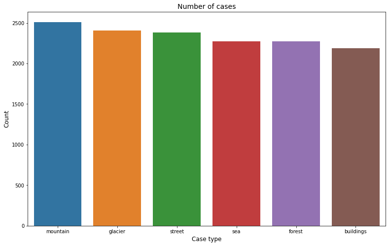

  * Fourtunately, the dataset has plenty of images and there was no cleaning, creating required.

Using the OSEM process we will build an autoencoder and an image classifier.

### Autoencoder
  * Is used to condense the information in the images
  * Condensing the information allows the autoencoder learn the most important parts of an image
  * Once the images are condensed the decoder will use the learned information to expand the images to the original size

### Image Classification
 * Is created to teach the machine to predict what the image is showing

This is an unbalanced multi-class classification problem; thought because we have plenty of each image, we will not need to create more images.

  
Click to read about the trail dataset autoencoded! 

  
  ## Autoencoder
    
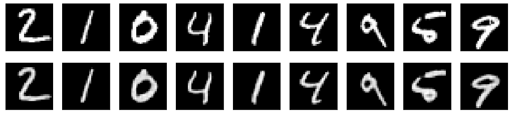

  * Here you can see that the original images (top) that are inputed are condensed and then reblown into blurry images of it self (bottom).

#### Noisy Autoencoder
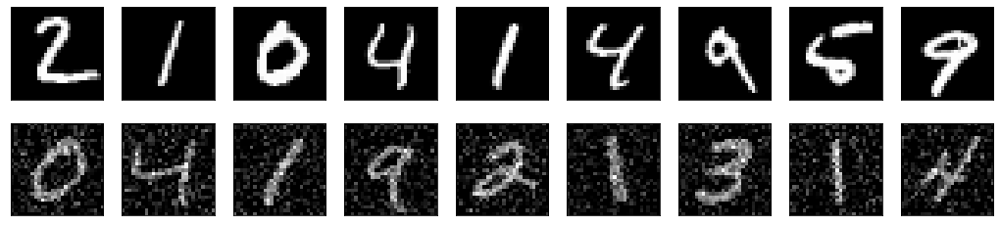

  * Here we can see that the "noisy" input (bottom), meaning having additional pixels added, outputs clean images simlar to the original images

  
Click to read about the trail dataset image classification! 

  
  ## Classification
    
#### Simple CNN (Central Neural Network) for Image Classification

When creating a simple image classification there are different methods of making sure how well the machine is learning. 

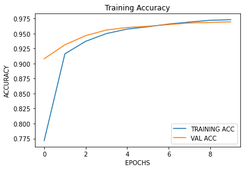

  * These show how well the model has been learning. The higher the accuracy during training and validation dictates better results
  * Lower loss shows that the amount of error is decreasing

#### Confusion Matrix

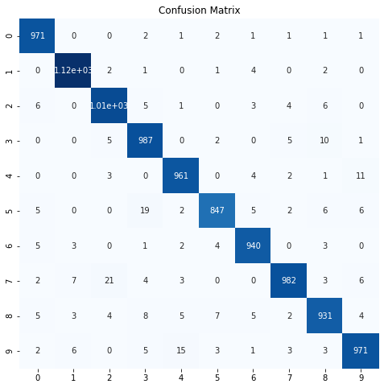

  * These are a great visual representation of how well the model is performing and learning.
  * The diagnoal line of the confusion matrix indicates the accurately labeled images.

#### Classification Report
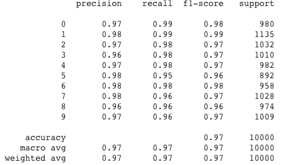

* Another way of seeing how well the images are being identified.

##### Conclusions:

The MNIST dataset is used in order to complete the trial code. The evaluations of the models are a good indication of the experiment goal results.

# Control

  
Click to read about modeling the control data! 

  
  ## Dataset
  The kaggle data is a dataset of images of building, forest, glacier, mountain, sea and street.

   

There is a decent amount of images available for each category, but it may impact the amount that can be learned from the current amount of images.

  

    
Click to view examples of the images in the dataset
    
 
   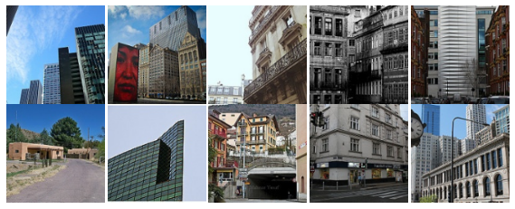
   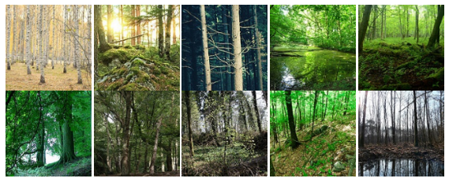
   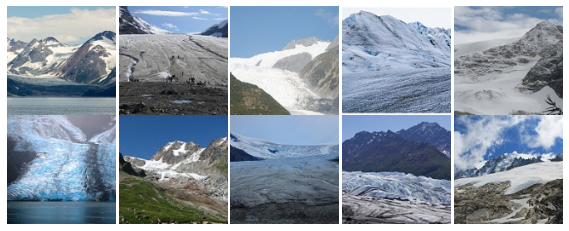
   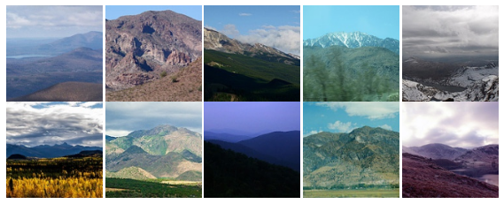
   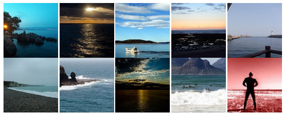
   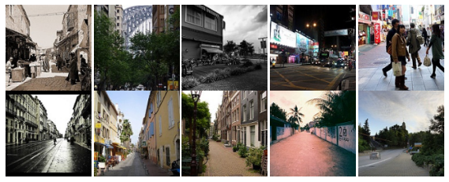
   

Click to view the control image autoencoder!

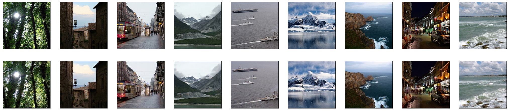

  

  
Click to read about modeling the control data image classification! 

  
  ## Modeling
  To model our data effectively; we created a image classifier with few simple layers.

   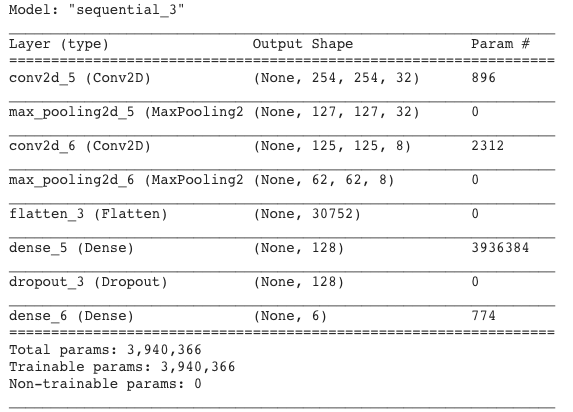

  * Conv2D 

    * Scans the image and takes each pixel value in a 3x3 (or 4x4, depends on setting) part and multiplies it by a certain weight, adds the numbers and uses that number as the value of the output image of that pixel
    * Depending on the weights, the output image can be blurred, brighter, darker, etc. (basicallu, slight photoshop)

  * MaxPooling2
    * Resizes the output image
    * Takes 2x2 area of a image and chooses the max value in each area
    * Shrinks the image by a factor of two
    * After shrinking usually the images are used for additional filters (Conv2D) in order to train on smaller scales to find more patterns
  
  * Flatten
    * Because we will be using Dense next, we need to use Flatten to reduce the number of dimensions to one dimension
  
  * Dense
    * Dense layers are hidden layers that use different acitvation functions to find the weights of each parameter of the image in order to appropriately learn the images

  * Dropout
    * Usually set to 40%, which means that 40% of the parameters that go into the Dropout are set to zero,
    * This helps the model not overfit

This leads us to having 3,940,000 differnt parameters that our model is using and going throught in order to train on the images.

## Evaluating Classification
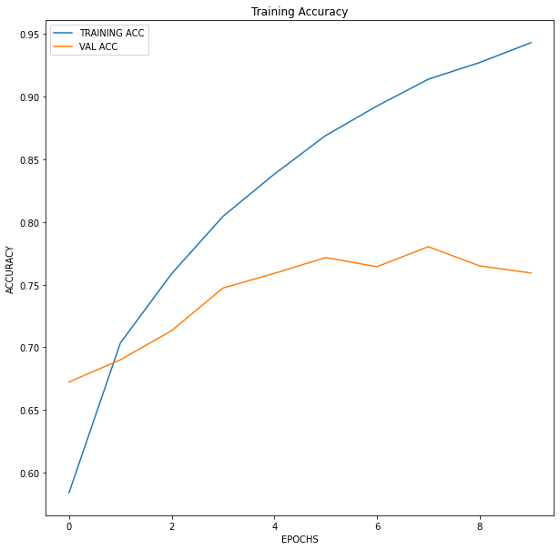
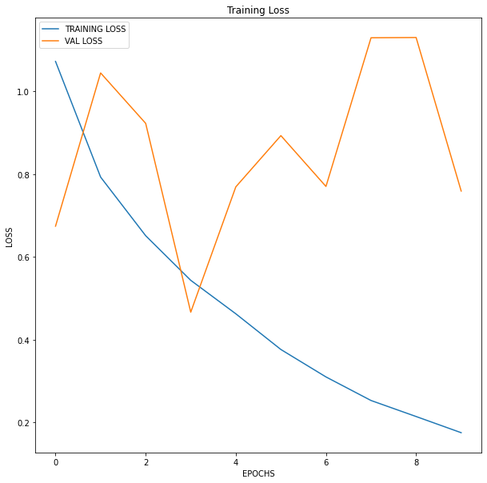
  
* Here we see that the training accuracy and loss is getting better with time but the spikes show that the models are not overfitting
 
   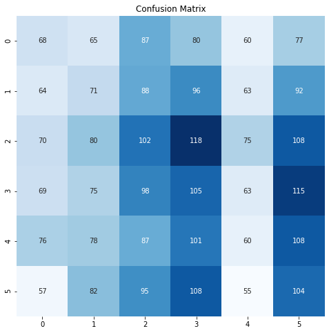
   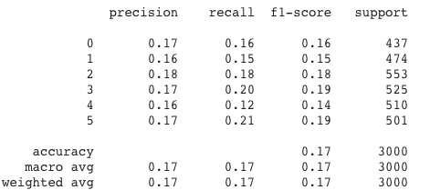

   * The image classification model shows that the simple control model is not that good at identifing the images.

  
  

# Experimental

  
Click to read about modeling the experimental data! 

  

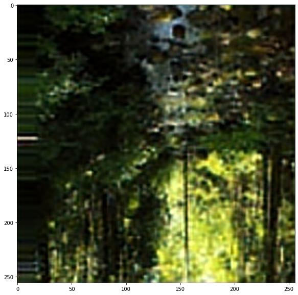

* Using these augmented images that are blurred as our input into the image classification. Instead of the original (focused) images we are using the images recreated by our autoencoder.

  

  
Click to read about modeling the experimental data for image classification! 

  
  ## Modeling
  To model our data effectively; we used the same image classifier throughout the experiment. 

   

## Evaluating Classification
  
Here we see the training accuracy and loss to get a better idea of what is going on
 
   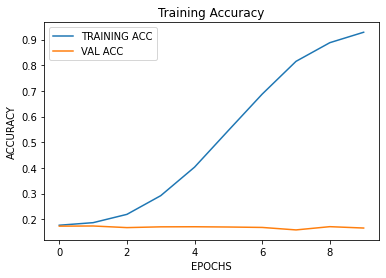
   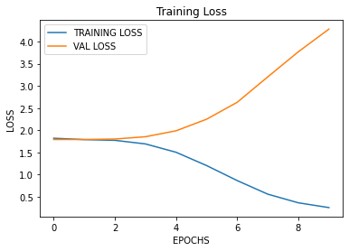

   * As shown above the accuracy of the training data is steadily going up, if the number of epochs is increased would still slowly climb.
   * The accuracy of the validation data is stagnant. This could mean that the model is overfitting for the triaining data that the new data is confusing it. 
   * The loss of the model is another indicator that in the current model it is overfitting. Menaing that that the loss of the training data is getting smaller but the validation data is growing due to the model not being familiar with it.

The image classification model shows that the simple image classification with the augmented images does not improve the models ability of classifing the images.

  
  

# Interpert

  
Click to read about interperting our results! 

  
  ## Interpreting the results
  * The way to interpret the results, is by reviewing the confusion matrices and classification report of both the images to see how well they had performed. 

  * The confusion matrices tells us how well the model performed on the test images by displaying what the model classified the images as based on the accurate labels of the images. 
  * As shown the confusion matrix of the augmented images, the majority of the images were classified as one type of image which drastically dropped the accuracy and reliability of the images. 
  * The original image classification seems to have had a more diverse outcome but still was fairly inaccurate.

By observing all the accuracy, loss, and confusion matrices of the model, we are able to infer that augmented images are not capable of increasing the accuracy of the images due to the models overfitting. 

  

# Future Work

  
 Click to future work for image classification! 

  
  ## Future work for experimenting with augmented images
  
  * Obtain more images of each category will give the model more refrences to learn from 
  * Create deeper models with more layer that can handle learning for longer periods of time and be more accurate
  * Attempt to use the encoded part of an images to classify the images instead of the entire image classification on recreated augmented images.

# Final Project Submission

* Student name: Alisa Radjabova
* Student pace: Full Time
* Instructor name: Rafael
* Blog post URL: 
* Presentation: 
* Video : 

